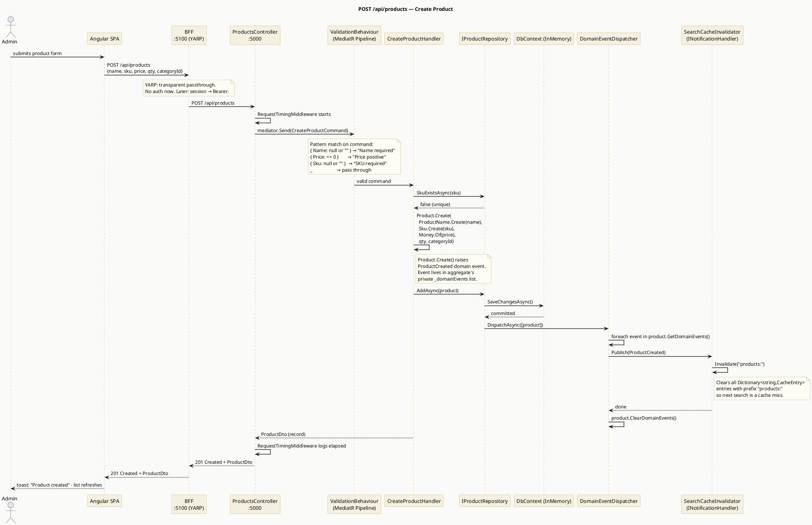
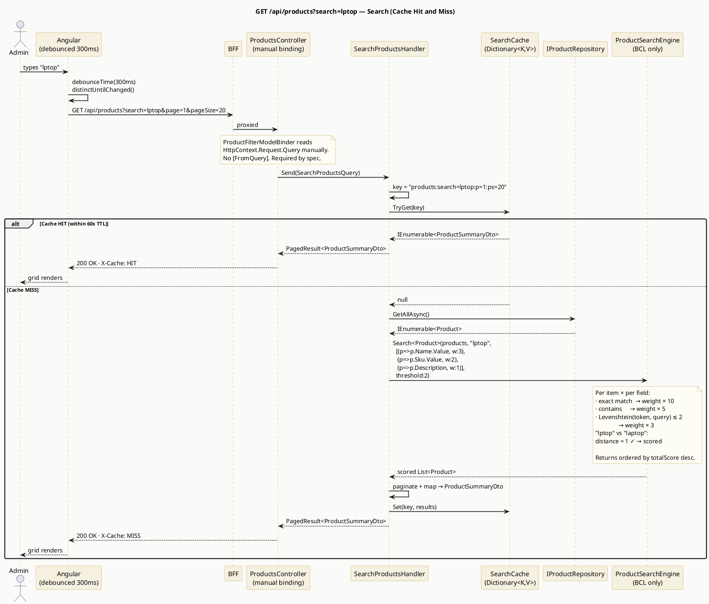
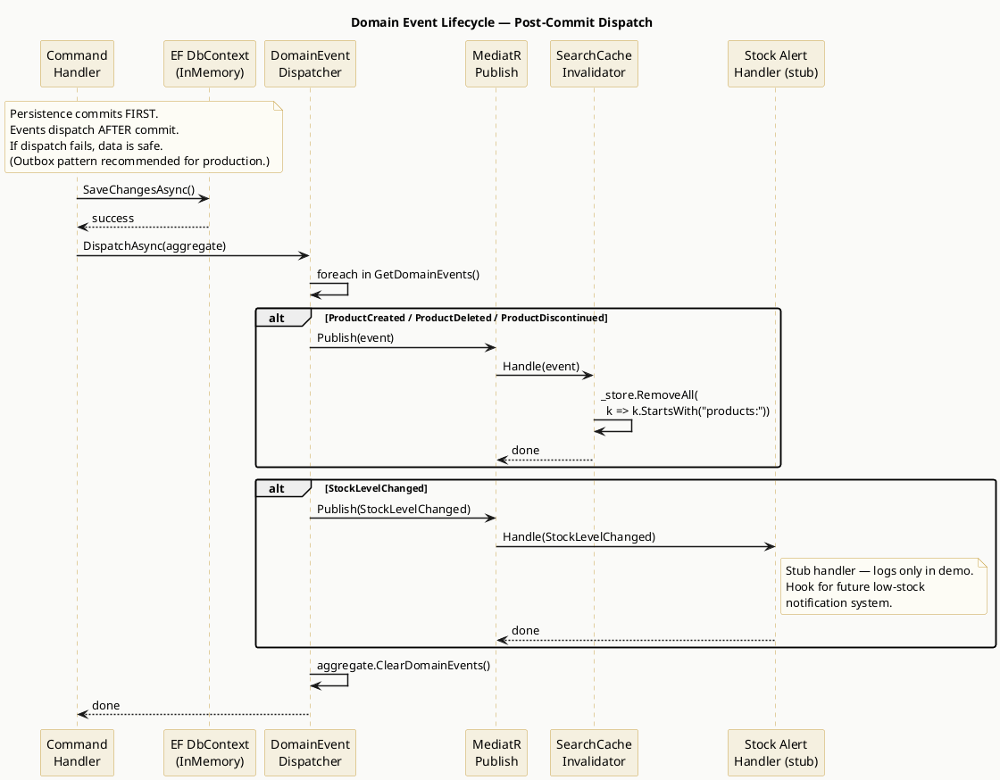
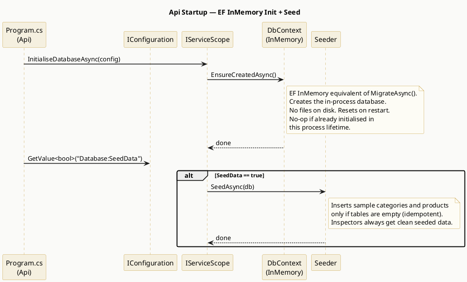

# Product Catalog — Agent Brief v3
> Senior C# / Angular Assessment · DDD · VSA · TDD · .NET BFF · Domain Events

**This document is the single source of truth. Agents must read it fully before writing
a single line of code. When in doubt, the answer is in here. Do not discover, do not
assume — refer back to this document.**

---

## 0. Reading Guide

| Section | Who Must Read It |
|---|---|
| 1–3 Repo + Architecture | Every agent |
| 4 Rich Domain Model | Domain + Application agents |
| 5 VSA Application Layer | Application agent |
| 6 BFF | BFF agent |
| 7 PlantUML Diagrams | All (reference for understanding flows) |
| 8 Dev Startup | DX agent + every agent for local testing |
| 9 Database Setup | Infrastructure agent |
| 10 AI Directory | First agent to run (creates this before anything else) |
| 11 GitHub Issues | Project lead agent only |
| 12–16 Rules + Packages | Every agent |

---

## 0.5 Philosophy

Read this before touching any code. These are not preferences — they are the reason
the system is structured the way it is.

We use **Domain-Driven Design** as our modelling language, **CQRS** to separate reads
from writes cleanly, **Domain Events** as the primary signal between parts of the system,
and **Vertical Slice Architecture** as the organisational structure for the Application layer.

These are not academic choices:

- **DDD** keeps business rules honest — they live in aggregates, not in handlers or
  controllers where they get duplicated, drifted, and forgotten.
- **Events** decouple reactions from the action that triggered them. The `CreateProduct`
  handler doesn't know or care that a cache needs invalidating — that's `OnProductCreated`'s
  job. Adding a second reaction requires zero changes to the handler.
- **VSA** means an agent or developer finds everything for "search products" in one folder
  and changes it without fear of breaking something unrelated.
- **CQRS** means queries never go through aggregates. Loading a full aggregate just to
  read two fields for a list view is wasteful and forces the domain model to serve two
  masters. Reads are projections. Writes are aggregate operations.

---

## 1. Repository Structure

```
ProductCatalog/
│
├── backend/
│   ├── ProductCatalog.Domain/
│   ├── ProductCatalog.Application/
│   ├── ProductCatalog.Infrastructure/
│   └── ProductCatalog.Api/
│
├── frontend/
│   ├── ProductCatalog.Bff/
│   └── product-catalog-ui/
│
├── tests/
│   ├── ProductCatalog.Domain.Tests/
│   └── ProductCatalog.Application.Tests/
│
├── .ai/                          ← AI context directory (created first)
│   ├── project.md
│   ├── architecture.md
│   ├── decisions/
│   │   ├── ADR-001-ef-inmemory-provider.md
│   │   ├── ADR-002-vsa-application-layer.md
│   │   ├── ADR-003-custom-thin-bff.md
│   │   └── ADR-004-domain-events-in-process.md
│   └── agents/
│       ├── AGENTS.md
│       └── CLAUDE.md
│
├── scripts/
│   ├── start-dev.sh              ← Unix startup script
│   └── start-dev.ps1             ← Windows startup script
│
├── Makefile                      ← Primary dev entrypoint
├── ProductCatalog.sln
├── .gitignore
├── README.md
└── SOLUTION.md
```

**Dependency flow — two separate worlds, linked only by HTTP:**

```
backend/  (project references — compile-time)
  Domain ← Application ← Infrastructure ← Api

frontend/  (no project references to backend/ — ever)
  Angular → BFF → [HTTP/YARP] → Api
```

The BFF knows the Api exists only as a URL in `appsettings.json`. There are no
`<ProjectReference>` entries pointing into `backend/` from `frontend/`. The boundary
between them is HTTP, not C# assemblies.

---

## 2. Tech Stack (Exact Versions)

| Layer | Technology | Version |
|---|---|---|
| Domain | C# / .NET 9 | 9.0 |
| Application | C# / .NET 9 + MediatR | 9.0 / 12.x |
| Infrastructure | EF Core InMemory | 9.x |
| API | ASP.NET Core 9 | 9.0 |
| BFF | ASP.NET Core 9 + YARP (custom thin BFF) | 9.0 / 2.x |
| Frontend | Angular + TypeScript | 17+ / 5.x |
| Styling | Tailwind CSS | 3.x |
| Test runner | xUnit + FluentAssertions + Moq | latest |

---

## 3. Architecture Overview

```
  frontend/  (two separate processes — same repo, separate apps)
 ┌──────────────────────────────────────────────────────┐
 │  Angular SPA  :4200                                  │
 │  Standalone · Reactive Forms · RxJS · Tailwind       │
 └─────────────────────┬────────────────────────────────┘
                       │ HTTP  /api/*
                       │ (proxied in dev, same-origin in prod)
 ┌─────────────────────▼────────────────────────────────┐
 │  ProductCatalog.Bff  :5100                           │
 │                                                      │
 │  ● Custom thin BFF — only NuGet dep is YARP          │
 │  ● YARP proxies /api/* to Api                        │
 │  ● CSRF token endpoint (/bff/antiforgery)            │
 │  ● Auth extension points commented, ready to wire    │
 │  ● Serves Angular static files in production         │
 └─────────────────────────────────────────────────────-┘

  No shared code. No project references. HTTP is the contract.

  ┌ ─ ─ ─ ─ ─ ─ ─ ─ Network boundary (HTTP :5000) ─ ─ ─ ─ ─ ─ ─ ─ ┐

  backend/  (four projects, one process)
 ┌──────────────────────────────────────────────────────┐
 │  ProductCatalog.Api  :5000                           │
 │                                                      │
 │  ● Thin controllers — dispatch only                  │
 │  ● Custom request timing middleware                  │
 │  ● Custom JSON converter (Sku)                       │
 │  ● Manual model binding (product filter)             │
 └─────────────────────┬────────────────────────────────┘
                       │ MediatR Send/Publish
 ┌─────────────────────▼────────────────────────────────┐
 │  ProductCatalog.Application  (VSA)                   │
 │                                                      │
 │  Features/Products/  Features/Categories/            │
 │  Common/Behaviours/  Common/Interfaces/              │
 │  Handlers/  (On{EventName}.cs)                       │
 └─────────────────────┬────────────────────────────────┘
                       │ Interfaces only (DI inversion)
 ┌─────────────────────▼────────────────────────────────┐
 │  ProductCatalog.Infrastructure                       │
 │                                                      │
 │  ● EF Core InMemory                                  │
 │  ● RepositoryBase<T, TId>                            │
 │  ● SearchCacheRepository (pure Dictionary)           │
 │  ● DomainEventDispatcher (post-SaveChanges)          │
 │  ● EnsureCreated + seed on startup                   │
 └──────────────────────────────────────────────────────┘
                       ↕ zero infrastructure references allowed
 ┌──────────────────────────────────────────────────────┐
 │  ProductCatalog.Domain  (pure — zero NuGet)          │
 │                                                      │
 │  ● AggregateRoot<TId>                                │
 │  ● Product + Category aggregates (rich)              │
 │  ● Value Objects: ProductName, Sku, Money,           │
 │    StockQuantity, ProductStatus                      │
 │  ● Domain Events · Domain Exceptions                 │
 └──────────────────────────────────────────────────────┘

  └ ─ ─ ─ ─ ─ ─ ─ ─ ─ ─ ─ ─ ─ ─ ─ ─ ─ ─ ─ ─ ─ ─ ─ ─ ─ ─ ─ ─ ─ ┘
```

---

## 4. Rich Domain Model

**The domain is NOT a data bag. Every class has behaviour, invariants, and guards.
There are no public setters. There are no setters at all on aggregates. All state
change goes through named business methods that raise domain events.**

### 4.1 Shared Kernel

**AggregateRoot.cs** — base for all aggregates:
```csharp
// backend/ProductCatalog.Domain/Shared/AggregateRoot.cs
public abstract class AggregateRoot<TId> where TId : notnull
{
    private readonly List<IDomainEvent> _domainEvents = [];

    public TId Id { get; protected init; } = default!;

    public IReadOnlyList<IDomainEvent> GetDomainEvents() => _domainEvents.AsReadOnly();
    public void ClearDomainEvents() => _domainEvents.Clear();
    protected void RaiseDomainEvent(IDomainEvent @event) => _domainEvents.Add(@event);
}
```

**IDomainEvent.cs:**
```csharp
// Pure domain interface. Zero external dependencies.
// MediatR does NOT appear here. The Application layer bridges the two.
public interface IDomainEvent
{
    DateTimeOffset OccurredAt { get; }
}
```

> **Domain has zero NuGet packages. None. Not even MediatR.Contracts.**
> The bridge is a generic wrapper record in the Application layer (see Section 5.1).
> Domain events are raised as plain `IDomainEvent` objects. The dispatcher in
> Infrastructure wraps each one in `DomainEventNotification<T>` before publishing
> to MediatR. The domain never knows MediatR exists.

**ValueObject.cs:**
```csharp
public abstract class ValueObject
{
    protected abstract IEnumerable<object?> GetEqualityComponents();

    public override bool Equals(object? obj)
    {
        if (obj is null || obj.GetType() != GetType()) return false;
        return ((ValueObject)obj).GetEqualityComponents()
            .SequenceEqual(GetEqualityComponents());
    }

    public override int GetHashCode() =>
        GetEqualityComponents()
            .Aggregate(0, (h, c) => HashCode.Combine(h, c?.GetHashCode() ?? 0));

    public static bool operator ==(ValueObject? a, ValueObject? b) =>
        a?.Equals(b) ?? b is null;
    public static bool operator !=(ValueObject? a, ValueObject? b) => !(a == b);
}
```

**DomainException.cs:**
```csharp
public sealed class DomainException(string message) : Exception(message);
```

**Guard.cs** — used inside value object factories and business methods:
```csharp
public static class Guard
{
    public static string AgainstNullOrWhiteSpace(string? value, string paramName)
    {
        if (string.IsNullOrWhiteSpace(value))
            throw new DomainException($"{paramName} cannot be null or whitespace.");
        return value;
    }

    public static decimal AgainstNegativeOrZero(decimal value, string paramName)
    {
        if (value <= 0)
            throw new DomainException($"{paramName} must be greater than zero.");
        return value;
    }

    public static int AgainstNegative(int value, string paramName)
    {
        if (value < 0)
            throw new DomainException($"{paramName} cannot be negative.");
        return value;
    }
}
```

### 4.2 Value Objects

**ProductName.cs:**
```csharp
public sealed class ProductName : ValueObject
{
    public string Value { get; }

    private ProductName(string value) => Value = value;

    public static ProductName Create(string value)
    {
        var cleaned = Guard.AgainstNullOrWhiteSpace(value, nameof(value)).Trim();
        if (cleaned.Length > 200)
            throw new DomainException("Product name cannot exceed 200 characters.");
        return new(cleaned);
    }

    protected override IEnumerable<object?> GetEqualityComponents()
    {
        yield return Value.ToUpperInvariant();
    }

    public override string ToString() => Value;
}
```

**Sku.cs** — format enforced: two uppercase letters, hyphen, six digits (e.g. EL-004521):
```csharp
public sealed class Sku : ValueObject
{
    private static readonly System.Text.RegularExpressions.Regex _format =
        new(@"^[A-Z]{2}-\d{6}$", System.Text.RegularExpressions.RegexOptions.Compiled);

    public string Value { get; }

    private Sku(string value) => Value = value;

    public static Sku Create(string value)
    {
        var upper = Guard.AgainstNullOrWhiteSpace(value, nameof(value)).ToUpperInvariant().Trim();
        if (!_format.IsMatch(upper))
            throw new DomainException($"SKU '{value}' is not valid. Expected format: XX-000000 (e.g. EL-004521).");
        return new(upper);
    }

    protected override IEnumerable<object?> GetEqualityComponents() { yield return Value; }
    public override string ToString() => Value;
}
```

**Money.cs:**
```csharp
public sealed class Money : ValueObject
{
    public decimal Amount { get; }
    public string Currency { get; }

    private Money(decimal amount, string currency)
    {
        Amount = amount;
        Currency = currency;
    }

    public static Money Of(decimal amount, string currency = "USD")
    {
        Guard.AgainstNegativeOrZero(amount, nameof(amount));
        Guard.AgainstNullOrWhiteSpace(currency, nameof(currency));
        return new(Math.Round(amount, 2), currency.ToUpperInvariant());
    }

    public Money Add(Money other)
    {
        if (Currency != other.Currency)
            throw new DomainException($"Cannot add money with different currencies: {Currency} and {other.Currency}.");
        return new(Amount + other.Amount, Currency);
    }

    protected override IEnumerable<object?> GetEqualityComponents()
    {
        yield return Amount;
        yield return Currency;
    }

    public override string ToString() => $"{Currency} {Amount:F2}";
}
```

**StockQuantity.cs** — this is where the "can't go negative" invariant lives:
```csharp
public sealed class StockQuantity : ValueObject
{
    public int Value { get; }

    private StockQuantity(int value) => Value = value;

    public static StockQuantity Of(int value)
    {
        Guard.AgainstNegative(value, nameof(value));
        return new(value);
    }

    public StockQuantity Adjust(int delta)
    {
        var result = Value + delta;
        if (result < 0)
            throw new DomainException(
                $"Insufficient stock. Available: {Value}, requested change: {delta}.");
        return new(result);
    }

    public bool IsEmpty => Value == 0;

    protected override IEnumerable<object?> GetEqualityComponents() { yield return Value; }
}
```

### 4.3 Product Aggregate (Full — Non-Anemic)

```csharp
// backend/ProductCatalog.Domain/Products/Product.cs
public sealed class Product : AggregateRoot<Guid>, IComparable<Product>
{
    // ── All private setters ──────────────────────────────────────────────
    public ProductName Name { get; private set; } = default!;
    public string? Description { get; private set; }
    public Sku Sku { get; private set; } = default!;
    public Money Price { get; private set; } = default!;
    public StockQuantity Quantity { get; private set; } = default!;
    public Guid CategoryId { get; private set; }
    public ProductStatus Status { get; private set; }
    public DateTimeOffset CreatedAt { get; private set; }
    public DateTimeOffset UpdatedAt { get; private set; }

    // ── EF Core needs a parameterless constructor — keep it private ──────
    private Product() { }

    // ── Static factory — only way to create a Product ───────────────────
    public static Product Create(
        ProductName name,
        string? description,
        Sku sku,
        Money price,
        int initialQuantity,
        Guid categoryId)
    {
        if (categoryId == Guid.Empty)
            throw new DomainException("CategoryId cannot be empty.");

        var now = DateTimeOffset.UtcNow;
        var product = new Product
        {
            Id = Guid.NewGuid(),
            Name = name,
            Description = description,
            Sku = sku,
            Price = price,
            Quantity = StockQuantity.Of(initialQuantity),
            CategoryId = categoryId,
            Status = initialQuantity > 0 ? ProductStatus.Active : ProductStatus.OutOfStock,
            CreatedAt = now,
            UpdatedAt = now
        };

        product.RaiseDomainEvent(new ProductCreated(product.Id, sku.Value, now));
        return product;
    }

    // ── Business method: update details ─────────────────────────────────
    public void UpdateDetails(
        ProductName name,
        string? description,
        Money price,
        Guid categoryId)
    {
        EnsureNotDiscontinued("update details on");

        Name = name;
        Description = description;
        Price = price;
        CategoryId = categoryId;
        UpdatedAt = DateTimeOffset.UtcNow;

        RaiseDomainEvent(new ProductUpdated(Id, DateTimeOffset.UtcNow));
    }

    // ── Business method: stock adjustment (positive = restock, negative = sale) ──
    public void AdjustStock(int delta)
    {
        EnsureNotDiscontinued("adjust stock on");

        var previous = Quantity.Value;
        Quantity = Quantity.Adjust(delta);   // throws DomainException if result < 0

        // Auto-transition status based on stock level
        Status = Quantity.IsEmpty ? ProductStatus.OutOfStock : ProductStatus.Active;
        UpdatedAt = DateTimeOffset.UtcNow;

        RaiseDomainEvent(new StockLevelChanged(Id, previous, Quantity.Value, DateTimeOffset.UtcNow));
    }

    // ── Business method: discontinue ────────────────────────────────────
    public void Discontinue()
    {
        if (Status == ProductStatus.Discontinued)
            throw new DomainException($"Product '{Name}' is already discontinued.");

        Status = ProductStatus.Discontinued;
        UpdatedAt = DateTimeOffset.UtcNow;

        RaiseDomainEvent(new ProductDiscontinued(Id, DateTimeOffset.UtcNow));
    }

    // ── Business method: reactivate (only discontinued products) ────────
    public void Reactivate(int restockQuantity)
    {
        if (Status != ProductStatus.Discontinued)
            throw new DomainException($"Only discontinued products can be reactivated. Current status: {Status}.");

        Guard.AgainstNegative(restockQuantity, nameof(restockQuantity));

        Quantity = StockQuantity.Of(restockQuantity);
        Status = restockQuantity > 0 ? ProductStatus.Active : ProductStatus.OutOfStock;
        UpdatedAt = DateTimeOffset.UtcNow;

        RaiseDomainEvent(new ProductReactivated(Id, DateTimeOffset.UtcNow));
    }

    // ── IComparable: sort by price ascending, then name alphabetically ───
    public int CompareTo(Product? other)
    {
        if (other is null) return 1;
        var priceComp = Price.Amount.CompareTo(other.Price.Amount);
        return priceComp != 0
            ? priceComp
            : string.Compare(Name.Value, other.Name.Value, StringComparison.OrdinalIgnoreCase);
    }

    // ── Private guard ────────────────────────────────────────────────────
    private void EnsureNotDiscontinued(string action) =>
        _ = Status == ProductStatus.Discontinued
            ? throw new DomainException($"Cannot {action} discontinued product '{Name}'.")
            : true;
}
```

**ProductStatus.cs:**
```csharp
public enum ProductStatus { Active, OutOfStock, Discontinued }
```

### 4.4 Domain Events (All as records)

```csharp
// Each in its own file under Products/Events/ or Categories/Events/

public record ProductCreated(Guid ProductId, string SkuValue, DateTimeOffset OccurredAt)
    : IDomainEvent;

public record ProductUpdated(Guid ProductId, DateTimeOffset OccurredAt)
    : IDomainEvent;

public record StockLevelChanged(Guid ProductId, int Previous, int Current, DateTimeOffset OccurredAt)
    : IDomainEvent;

public record ProductDiscontinued(Guid ProductId, DateTimeOffset OccurredAt)
    : IDomainEvent;

public record ProductReactivated(Guid ProductId, DateTimeOffset OccurredAt)
    : IDomainEvent;

public record CategoryCreated(Guid CategoryId, Guid? ParentId, DateTimeOffset OccurredAt)
    : IDomainEvent;
```

### 4.5 Category Aggregate (Non-Anemic)

```csharp
public sealed class Category : AggregateRoot<Guid>
{
    public string Name { get; private set; } = default!;
    public string? Description { get; private set; }
    public Guid? ParentCategoryId { get; private set; }
    public DateTimeOffset CreatedAt { get; private set; }

    private Category() { }

    public static Category Create(string name, string? description, Guid? parentCategoryId)
    {
        var now = DateTimeOffset.UtcNow;
        var category = new Category
        {
            Id = Guid.NewGuid(),
            Name = Guard.AgainstNullOrWhiteSpace(name, nameof(name)).Trim(),
            Description = description?.Trim(),
            ParentCategoryId = parentCategoryId,
            CreatedAt = now
        };

        category.RaiseDomainEvent(new CategoryCreated(category.Id, parentCategoryId, now));
        return category;
    }

    // Business methods
    public void Rename(string newName)
    {
        var cleaned = Guard.AgainstNullOrWhiteSpace(newName, nameof(newName)).Trim();
        if (Name == cleaned) return;
        Name = cleaned;
    }

    public void UpdateDescription(string? description) =>
        Description = description?.Trim();

    public void MoveTo(Guid? newParentId)
    {
        // Circular reference prevention is a domain service concern (needs all categories).
        // The CategoryHierarchyService handles that before calling this.
        if (newParentId == Id)
            throw new DomainException("A category cannot be its own parent.");
        ParentCategoryId = newParentId;
    }

    // Query methods on the aggregate
    public bool IsRoot() => ParentCategoryId is null;
}
```

### 4.6 Repository Interfaces (in Domain)

```csharp
// Domain/Shared/IRepository.cs
public interface IRepository<TEntity, in TId>
    where TEntity : AggregateRoot<TId>
    where TId : notnull
{
    Task<TEntity?> GetByIdAsync(TId id, CancellationToken ct = default);
    Task<IEnumerable<TEntity>> GetAllAsync(CancellationToken ct = default);
    Task AddAsync(TEntity entity, CancellationToken ct = default);
    Task UpdateAsync(TEntity entity, CancellationToken ct = default);
    Task DeleteAsync(TId id, CancellationToken ct = default);
    Task<bool> ExistsAsync(TId id, CancellationToken ct = default);
}

// Domain/Products/IProductRepository.cs
public interface IProductRepository : IRepository<Product, Guid>
{
    Task<bool> SkuExistsAsync(string skuValue, Guid? excludeProductId = null, CancellationToken ct = default);
    Task<IEnumerable<Product>> GetByCategoryAsync(Guid categoryId, CancellationToken ct = default);
}

// Domain/Categories/ICategoryRepository.cs
public interface ICategoryRepository : IRepository<Category, Guid>
{
    Task<bool> HasChildCategoriesAsync(Guid categoryId, CancellationToken ct = default);
}
```

---

## 5. VSA Application Layer

**VSA = Vertical Slice Architecture. The Application layer is organised by feature use-case,
not by type. Every slice folder contains everything for that one operation.**

### 5.1 Structure

```
backend/ProductCatalog.Application/
│
├── Common/
│   ├── Behaviours/
│   │   ├── ValidationBehaviour.cs     ← pattern matching validation pipeline
│   │   └── LoggingBehaviour.cs        ← logs command name + elapsed ms
│   ├── Interfaces/
│   │   ├── ISearchCache.cs            ← TryGet / Set / Invalidate
│   │   └── IDomainEventDispatcher.cs  ← dispatches after SaveChanges
│   ├── Events/
│   │   └── DomainEventNotification.cs ← MediatR bridge: wraps IDomainEvent → INotification
│   ├── Exceptions/
│   │   ├── NotFoundException.cs
│   │   └── ValidationException.cs
│   └── DTOs/
│       └── PagedResult.cs             ← shared generic — record PagedResult<T>
│
├── Features/
│   ├── Products/
│   │   ├── CreateProduct/
│   │   │   ├── CreateProductCommand.cs
│   │   │   └── CreateProductHandler.cs
│   │   ├── UpdateProduct/
│   │   │   ├── UpdateProductCommand.cs
│   │   │   └── UpdateProductHandler.cs
│   │   ├── DeleteProduct/
│   │   │   ├── DeleteProductCommand.cs
│   │   │   └── DeleteProductHandler.cs
│   │   ├── AdjustStock/
│   │   │   ├── AdjustStockCommand.cs
│   │   │   └── AdjustStockHandler.cs
│   │   ├── DiscontinueProduct/
│   │   │   ├── DiscontinueProductCommand.cs
│   │   │   └── DiscontinueProductHandler.cs
│   │   ├── GetProductById/
│   │   │   ├── GetProductByIdQuery.cs
│   │   │   ├── GetProductByIdHandler.cs
│   │   │   └── ProductDto.cs          ← slice owns its response shape
│   │   ├── GetProducts/
│   │   │   ├── GetProductsQuery.cs
│   │   │   ├── GetProductsHandler.cs
│   │   │   └── ProductSummaryDto.cs   ← leaner shape for list view
│   │   └── SearchProducts/
│   │       ├── SearchProductsQuery.cs
│   │       ├── SearchProductsHandler.cs
│   │       └── ProductSearchEngine.cs  ← BCL only; owned by this slice; move to Common if reused
│   │
│   └── Categories/
│       ├── CreateCategory/
│       │   ├── CreateCategoryCommand.cs
│       │   └── CreateCategoryHandler.cs
│       ├── GetCategories/
│       │   ├── GetCategoriesQuery.cs
│       │   ├── GetCategoriesHandler.cs
│       │   └── CategoryDto.cs
│       └── GetCategoryTree/
│           ├── GetCategoryTreeQuery.cs
│           ├── GetCategoryTreeHandler.cs
│           └── CategoryTreeDto.cs     ← recursive record
│
└── Handlers/
    │   ← Domain event notification handlers live here — NOT inside feature slices.
│   │   ← Events are facts raised by aggregates. Any handler can react to any event.
│   │   ← Ownership lives with the reaction, not the aggregate that raised the event.
│   ├── OnProductCreated.cs    ← invalidates search cache

│   └── OnProductUpdated.cs    ← invalidates search cache
│   ├── OnProductDeleted.cs    ← invalidates search cache
│   ├── OnProductDiscontinued.cs ← invalidates search cache
│   ├── OnProductReactivated.cs ← invalidates search cache
│   ├── OnStockLevelChanged.cs ← logs low stock warning
│   └── OnCategoryCreated.cs   ← stub (future: category cache invalidation)
```

> **Why `Handlers/` is a peer of `Features/`, not inside it:**
> Domain events have no single owner. `ProductCreated` could invalidate a search cache,
> write an audit entry, and trigger a warehouse notification — three handlers, three
> concerns, zero connection to the `CreateProduct` slice that happened to raise the event.
> Placing `SearchCacheInvalidator` inside `CreateProduct/` would incorrectly imply that
> slice owns the reaction. It doesn't. Events are broadcast. Handlers subscribe.

### 5.2 MediatR Bridge — DomainEventNotification\<T\>

This is the key architectural seam. Domain events are plain C# objects. MediatR needs
`INotification`. The wrapper lives in Application — the only layer that knows about both.

```csharp
// Application/Common/Events/DomainEventNotification.cs
// Application knows about both Domain (IDomainEvent) and MediatR (INotification).
// Domain knows about neither MediatR nor this wrapper.
public record DomainEventNotification<T>(T DomainEvent) : INotification
    where T : IDomainEvent;
```

**DomainEventDispatcher.cs (Infrastructure)** uses reflection to create the generic wrapper:

```csharp
// Infrastructure/Persistence/DomainEventDispatcher.cs
public sealed class DomainEventDispatcher(IMediator mediator) : IDomainEventDispatcher
{
    public async Task DispatchAsync(
        IEnumerable<AggregateRoot<Guid>> aggregates,
        CancellationToken ct = default)
    {
        foreach (var aggregate in aggregates)
        {
            foreach (var domainEvent in aggregate.GetDomainEvents())
            {
                // Wrap the plain IDomainEvent in the MediatR-aware notification
                var notificationType = typeof(DomainEventNotification<>)
                    .MakeGenericType(domainEvent.GetType());

                var notification = Activator.CreateInstance(notificationType, domainEvent)
                    as INotification
                    ?? throw new InvalidOperationException(
                        $"Could not create notification for {domainEvent.GetType().Name}");

                await mediator.Publish(notification, ct);
            }

            aggregate.ClearDomainEvents();
        }
    }
}
```

**Notification handlers** in Application subscribe to the wrapped type. They live in
`Application/Handlers/` — not inside any feature slice:

```csharp
// Application/Handlers/SearchCacheInvalidator.cs
// Reacts to any event that makes cached search results stale.
// NOT in Features/Products/CreateProduct/ — this reaction is not owned by that slice.
public sealed class SearchCacheInvalidator(ISearchCache cache)
    : INotificationHandler<DomainEventNotification<ProductCreated>>,
      INotificationHandler<DomainEventNotification<ProductDeleted>>,
      INotificationHandler<DomainEventNotification<ProductDiscontinued>>,
      INotificationHandler<DomainEventNotification<ProductReactivated>>
{
    public Task Handle(DomainEventNotification<ProductCreated> n, CancellationToken ct)
    {
        cache.Invalidate("products:");
        return Task.CompletedTask;
    }

    public Task Handle(DomainEventNotification<ProductDeleted> n, CancellationToken ct)
    {
        cache.Invalidate("products:");
        return Task.CompletedTask;
    }

    public Task Handle(DomainEventNotification<ProductDiscontinued> n, CancellationToken ct)
    {
        cache.Invalidate("products:");
        return Task.CompletedTask;
    }
}
```

The domain event payload is always accessible via `n.DomainEvent` if the handler needs it.

**Application/Handlers/StockAlertHandler.cs** — stub, ready to extend:
```csharp
// Reacts to StockLevelChanged regardless of which command triggered it.
// AdjustStock, Reactivate, or any future command can raise this event.
public sealed class StockAlertHandler(ILogger<StockAlertHandler> logger)
    : INotificationHandler<DomainEventNotification<StockLevelChanged>>
{
    public Task Handle(DomainEventNotification<StockLevelChanged> n, CancellationToken ct)
    {
        var e = n.DomainEvent;
        if (e.Current == 0)
            logger.LogWarning("Product {ProductId} is now out of stock.", e.ProductId);
        else if (e.Current <= 5)
            logger.LogInformation("Product {ProductId} low stock: {Qty} remaining.", e.ProductId, e.Current);
        // Future: publish integration event to warehouse system here
        return Task.CompletedTask;
    }
}
```

### 5.3 Slice Examples

**CreateProductCommand.cs:**
```csharp
// Every command/query is a record implementing IRequest<TResponse>
public record CreateProductCommand(
    string Name,
    string? Description,
    string Sku,
    decimal Price,
    string Currency,
    int InitialQuantity,
    Guid CategoryId
) : IRequest<ProductDto>;
```

**CreateProductHandler.cs — thin: load, call, save:**
```csharp
public sealed class CreateProductHandler(
    IProductRepository productRepo,
    ICategoryRepository categoryRepo,
    IDomainEventDispatcher dispatcher)
    : IRequestHandler<CreateProductCommand, ProductDto>
{
    public async Task<ProductDto> Handle(CreateProductCommand cmd, CancellationToken ct)
    {
        // Guard: category must exist
        if (!await categoryRepo.ExistsAsync(cmd.CategoryId, ct))
            throw new NotFoundException(nameof(Category), cmd.CategoryId);

        // Guard: SKU uniqueness
        if (await productRepo.SkuExistsAsync(cmd.Sku, ct: ct))
            throw new ValidationException($"SKU '{cmd.Sku}' is already in use.");

        // Build domain objects — Value Object factories enforce their own invariants
        var product = Product.Create(
            ProductName.Create(cmd.Name),
            cmd.Description,
            Sku.Create(cmd.Sku),
            Money.Of(cmd.Price, cmd.Currency),
            cmd.InitialQuantity,
            cmd.CategoryId);

        await productRepo.AddAsync(product, ct);
        await dispatcher.DispatchAsync([product], ct);

        return product.ToDto();   // static extension method — see mapping note below
    }
}
```

**Mapping note:** Each slice defines its own mapping as a static extension method in the same
folder (not AutoMapper, not a shared mapper):

```csharp
// In CreateProduct/ProductMappings.cs (or inline in ProductDto.cs)
internal static class ProductMappings
{
    internal static ProductDto ToDto(this Product p) => new(
        p.Id, p.Name.Value, p.Description, p.Sku.Value,
        p.Price.Amount, p.Price.Currency,
        p.Quantity.Value, p.CategoryId, p.Status.ToString(),
        p.CreatedAt, p.UpdatedAt);
}
```

**ValidationBehaviour.cs — pattern matching as specified:**
```csharp
public sealed class ValidationBehaviour<TRequest, TResponse>(ILogger<ValidationBehaviour<TRequest, TResponse>> logger)
    : IPipelineBehavior<TRequest, TResponse>
    where TRequest : IRequest<TResponse>
{
    public async Task<TResponse> Handle(TRequest request, RequestHandlerDelegate<TResponse> next, CancellationToken ct)
    {
        var error = request switch
        {
            CreateProductCommand { Name: null or "" }        => "Name is required",
            CreateProductCommand { Price: <= 0 }             => "Price must be positive",
            CreateProductCommand { Sku: null or "" }         => "SKU is required",
            CreateProductCommand { InitialQuantity: < 0 }    => "Quantity cannot be negative",
            CreateProductCommand { CategoryId: var id }
                when id == Guid.Empty                        => "CategoryId is required",
            UpdateProductCommand { Name: null or "" }        => "Name is required",
            AdjustStockCommand { ProductId: var id }
                when id == Guid.Empty                        => "ProductId is required",
            CreateCategoryCommand { Name: null or "" }       => "Category name is required",
            _                                                => null
        };

        if (error is not null)
        {
            logger.LogWarning("Validation failed for {Request}: {Error}", typeof(TRequest).Name, error);
            throw new ValidationException(error);
        }

        return await next();
    }
}
```

**GetCategoryTreeHandler.cs — recursive tree build:**
```csharp
public sealed class GetCategoryTreeHandler(ICategoryRepository repo)
    : IRequestHandler<GetCategoryTreeQuery, IReadOnlyList<CategoryTreeDto>>
{
    public async Task<IReadOnlyList<CategoryTreeDto>> Handle(GetCategoryTreeQuery query, CancellationToken ct)
    {
        var all = await repo.GetAllAsync(ct);
        var lookup = all.ToLookup(c => c.ParentCategoryId);
        return BuildTree(lookup, parentId: null);
    }

    private static IReadOnlyList<CategoryTreeDto> BuildTree(
        ILookup<Guid?, Category> lookup,
        Guid? parentId)
    {
        return lookup[parentId]
            .OrderBy(c => c.Name)
            .Select(c => new CategoryTreeDto(
                c.Id,
                c.Name,
                c.Description,
                BuildTree(lookup, c.Id)))
            .ToList()
            .AsReadOnly();
    }
}
```

**CategoryTreeDto.cs** — recursive record:
```csharp
public record CategoryTreeDto(
    Guid Id,
    string Name,
    string? Description,
    IReadOnlyList<CategoryTreeDto> Children);
```

**ProductSearchEngine.cs — BCL only, generic, weighted Levenshtein:**
```csharp
// RULE: Zero NuGet packages. Only System.* namespaces.
public sealed class ProductSearchEngine
{
    public IReadOnlyList<T> Search<T>(
        IEnumerable<T> items,
        string query,
        IReadOnlyList<(Func<T, string?> Field, int Weight)> fields,
        int levenshteinThreshold = 2)
    {
        if (string.IsNullOrWhiteSpace(query))
            return items.ToList().AsReadOnly();

        var q = query.Trim().ToUpperInvariant();
        var scored = new List<(T Item, int Score)>();

        foreach (var item in items)
        {
            int totalScore = 0;
            foreach (var (fieldSelector, weight) in fields)
            {
                var fieldValue = fieldSelector(item)?.Trim().ToUpperInvariant() ?? string.Empty;
                if (fieldValue.Length == 0) continue;

                // Exact match
                if (fieldValue == q) { totalScore += weight * 10; continue; }
                // Contains
                if (fieldValue.Contains(q, StringComparison.Ordinal)) { totalScore += weight * 5; continue; }
                // Fuzzy: any token within distance
                foreach (var token in fieldValue.Split(' ', StringSplitOptions.RemoveEmptyEntries))
                {
                    if (LevenshteinDistance(token, q) <= levenshteinThreshold)
                    {
                        totalScore += weight * 3;
                        break;
                    }
                }
            }
            if (totalScore > 0) scored.Add((item, totalScore));
        }

        return scored
            .OrderByDescending(x => x.Score)
            .Select(x => x.Item)
            .ToList()
            .AsReadOnly();
    }

    private static int LevenshteinDistance(string a, string b)
    {
        if (a.Length == 0) return b.Length;
        if (b.Length == 0) return a.Length;

        var dp = new int[a.Length + 1, b.Length + 1];
        for (int i = 0; i <= a.Length; i++) dp[i, 0] = i;
        for (int j = 0; j <= b.Length; j++) dp[0, j] = j;

        for (int i = 1; i <= a.Length; i++)
            for (int j = 1; j <= b.Length; j++)
                dp[i, j] = a[i - 1] == b[j - 1]
                    ? dp[i - 1, j - 1]
                    : 1 + Math.Min(dp[i - 1, j - 1], Math.Min(dp[i - 1, j], dp[i, j - 1]));

        return dp[a.Length, b.Length];
    }
}
```

---

## 6. BFF — ProductCatalog.Bff

### 6.1 Purpose

The BFF is the **only** service Angular talks to. It is our own thin proxy — no
third-party BFF framework, just YARP and standard ASP.NET Core middleware.

This keeps the dependency list minimal and the code fully ours. When auth is needed
later, we add `AddAuthentication().AddOpenIdConnect()` and a session cookie — all
standard ASP.NET Core. Nothing proprietary.

### 6.2 What the BFF Does

```
┌──────────────────────────────────────────────────────┐
│  ProductCatalog.Bff — responsibilities               │
│                                                      │
│  1. Proxy /api/* → ProductCatalog.Api via YARP       │
│  2. CSRF protection (antiforgery token endpoint)     │
│  3. CORS for Angular dev server (:4200)              │
│  4. Health check endpoint (/health)                  │
│  5. Serve Angular static files (production)          │
│                                                      │
│  Auth extension points (wired, inactive):            │
│  ● AddAuthentication() slot in DI                    │
│  ● UseAuthentication() / UseAuthorization() slot     │
│  ● /bff/login + /bff/logout minimal endpoints slot   │
│  ● YARP route RequireAuthorization() slot            │
└──────────────────────────────────────────────────────┘
```

### 6.3 Program.cs (Full, Annotated)

```csharp
// frontend/ProductCatalog.Bff/Program.cs
var builder = WebApplication.CreateBuilder(args);

// ── 1. YARP Reverse Proxy ──────────────────────────────────────────────
// All /api/* traffic forwarded to ProductCatalog.Api.
// Route + cluster config in appsettings.json ReverseProxy section.
builder.Services.AddReverseProxy()
    .LoadFromConfig(builder.Configuration.GetSection("ReverseProxy"));

// ── 2. CSRF Protection ─────────────────────────────────────────────────
// Antiforgery is built into ASP.NET Core — no extra package needed.
// Angular reads the cookie and sends X-XSRF-TOKEN on mutating requests.
builder.Services.AddAntiforgery(options =>
    options.HeaderName = "X-XSRF-TOKEN");

// ── 3. Auth Extension Point ────────────────────────────────────────────
// When auth is needed, add here:
//   builder.Services.AddAuthentication(options => { ... })
//       .AddCookie("session")
//       .AddOpenIdConnect("oidc", options => {
//           options.Authority = "https://your-identity-server";
//           options.ClientId  = "product-catalog-bff";
//           options.ResponseType = "code";
//           options.SaveTokens = true;
//       });
//   builder.Services.AddAuthorization();

// ── 4. CORS — dev only ─────────────────────────────────────────────────
if (builder.Environment.IsDevelopment())
{
    builder.Services.AddCors(options =>
        options.AddPolicy("DevAngular", p => p
            .WithOrigins("http://localhost:4200")
            .AllowAnyHeader()
            .AllowAnyMethod()
            .AllowCredentials()));
}

// ── 5. Health checks ───────────────────────────────────────────────────
builder.Services.AddHealthChecks();

var app = builder.Build();

// ── Middleware pipeline — order matters ────────────────────────────────
if (app.Environment.IsDevelopment())
    app.UseCors("DevAngular");

app.UseAntiforgery();

// Auth middleware slots (inactive — uncomment when auth is added):
// app.UseAuthentication();
// app.UseAuthorization();

// ── CSRF token endpoint ────────────────────────────────────────────────
// Angular calls GET /bff/antiforgery on startup to receive the token cookie.
app.MapGet("/bff/antiforgery", (IAntiforgery af, HttpContext ctx) =>
{
    var tokens = af.GetAndStoreTokens(ctx);
    ctx.Response.Cookies.Append("XSRF-TOKEN", tokens.RequestToken!,
        new CookieOptions { HttpOnly = false }); // must be readable by JS
    return Results.Ok();
}).AllowAnonymous();

// ── Auth management endpoints (inactive — add when auth is wired) ──────
// app.MapGet("/bff/login",  ...) → redirect to OIDC provider
// app.MapGet("/bff/logout", ...) → clear session + redirect
// app.MapGet("/bff/user",   ...) → return claims as JSON for Angular

// ── Health ─────────────────────────────────────────────────────────────
app.MapHealthChecks("/health");

// ── YARP — proxies /api/* to Api ───────────────────────────────────────
// When auth is added: .RequireAuthorization() on routes that need it.
app.MapReverseProxy();

// ── Angular SPA static files (production) ──────────────────────────────
// In dev, Angular serves itself on :4200. In prod, output lands here.
app.UseDefaultFiles();
app.UseStaticFiles();
app.MapFallbackToFile("index.html");

app.Run();
```

### 6.4 appsettings.json

```json
{
  "Logging": {
    "LogLevel": { "Default": "Information" }
  },
  "AllowedHosts": "*",
  "ReverseProxy": {
    "Routes": {
      "api-route": {
        "ClusterId": "api-cluster",
        "Match": { "Path": "/api/{**catch-all}" }
      }
    },
    "Clusters": {
      "api-cluster": {
        "Destinations": {
          "api-primary": {
            "Address": "http://localhost:5000"
          }
        }
      }
    }
  }
}
```

### 6.5 BFF .csproj — One Package Only

```xml
<Project Sdk="Microsoft.NET.Sdk.Web">
  <PropertyGroup>
    <TargetFramework>net9.0</TargetFramework>
    <Nullable>enable</Nullable>
    <ImplicitUsings>enable</ImplicitUsings>
    <TreatWarningsAsErrors>true</TreatWarningsAsErrors>
  </PropertyGroup>
  <ItemGroup>
    <PackageReference Include="Yarp.ReverseProxy" Version="2.*" />
  </ItemGroup>
</Project>
```

> Antiforgery, CORS, authentication, and authorization are all built into
> `Microsoft.NET.Sdk.Web`. No additional BFF framework required.

### 6.6 What Changes When Auth Is Added

1. Uncomment `AddAuthentication().AddCookie().AddOpenIdConnect()` in DI
2. Uncomment `UseAuthentication()` / `UseAuthorization()` in pipeline
3. Implement `/bff/login`, `/bff/logout`, `/bff/user` minimal API endpoints
4. Add `.RequireAuthorization()` to YARP route mapping
5. Angular includes `X-XSRF-TOKEN` header on POST/PUT/DELETE (already reads the cookie)

Changes are contained entirely to `Program.cs`. Nothing in Angular or Api changes.

---

## 7. PlantUML Diagrams

> Render at https://www.plantuml.com/plantuml/ or VS Code PlantUML extension.
> Theme: warm neutral, amber `#C9A247` borders, no loud backgrounds, shadowing false.

### 7.1 Domain Class Diagram

```plantuml
@startuml ProductCatalog_Domain

skinparam shadowing false
skinparam roundcorner 5
skinparam classAttributeIconSize 0
skinparam backgroundColor #FAFAF8
skinparam classBackgroundColor #FFFFFF
skinparam classBorderColor #C9A247
skinparam classHeaderBackgroundColor #F5F0E0
skinparam arrowColor #7A6630
skinparam fontName "Segoe UI"
skinparam packageBorderColor #C9A247
skinparam packageBackgroundColor #FDFCF5

package "Shared Kernel" #FDFCF5 {
  abstract class "AggregateRoot<TId>" as AR {
    + Id : TId
    # RaiseDomainEvent(e: IDomainEvent)
    + GetDomainEvents()
    + ClearDomainEvents()
  }

  interface IDomainEvent {
    + OccurredAt : DateTimeOffset
  }

  abstract class ValueObject {
    # GetEqualityComponents()
    + Equals() : bool
  }

  class Guard <<static>> {
    + AgainstNullOrWhiteSpace()
    + AgainstNegativeOrZero()
    + AgainstNegative()
  }

  class DomainException
}

package "Products" #FDFCF5 {
  class Product {
    + Id : Guid
    + Name : ProductName
    + Description : string?
    + Sku : Sku
    + Price : Money
    + Quantity : StockQuantity
    + CategoryId : Guid
    + Status : ProductStatus
    + CreatedAt / UpdatedAt
    ..
    + {static} Create(...) : Product
    + UpdateDetails(...) : void
    + AdjustStock(delta: int) : void
    + Discontinue() : void
    + Reactivate(qty: int) : void
    + CompareTo(other) : int
  }

  class ProductName <<VO>> {
    + Value : string
    + {static} Create(value) : ProductName
  }

  class Sku <<VO>> {
    + Value : string  ''XX-000000 format''
    + {static} Create(value) : Sku
  }

  class Money <<VO>> {
    + Amount : decimal
    + Currency : string
    + {static} Of(amount, currency) : Money
    + Add(other: Money) : Money
  }

  class StockQuantity <<VO>> {
    + Value : int
    + IsEmpty : bool
    + {static} Of(value) : StockQuantity
    + Adjust(delta: int) : StockQuantity
  }

  enum ProductStatus {
    Active
    OutOfStock
    Discontinued
  }

  class ProductCreated <<Event>> {
    + ProductId : Guid
    + SkuValue : string
  }
  class ProductUpdated <<Event>> { + ProductId : Guid }
  class StockLevelChanged <<Event>> {
    + ProductId : Guid
    + Previous : int
    + Current : int
  }
  class ProductDiscontinued <<Event>> { + ProductId : Guid }
  class ProductReactivated <<Event>> { + ProductId : Guid }
}

package "Categories" #FDFCF5 {
  class Category {
    + Id : Guid
    + Name : string
    + Description : string?
    + ParentCategoryId : Guid?
    + CreatedAt : DateTimeOffset
    ..
    + {static} Create(...) : Category
    + Rename(name: string) : void
    + UpdateDescription(desc) : void
    + MoveTo(parentId: Guid?) : void
    + IsRoot() : bool
  }

  class CategoryCreated <<Event>> {
    + CategoryId : Guid
    + ParentId : Guid?
  }
}

AR <|-- Product
AR <|-- Category
ValueObject <|-- ProductName
ValueObject <|-- Sku
ValueObject <|-- Money
ValueObject <|-- StockQuantity

Product *-- ProductName
Product *-- Sku
Product *-- Money
Product *-- StockQuantity
Product --> ProductStatus

Product ..> ProductCreated : raises
Product ..> ProductUpdated : raises
Product ..> StockLevelChanged : raises
Product ..> ProductDiscontinued : raises
Product ..> ProductReactivated : raises
Category ..> CategoryCreated : raises

IDomainEvent <|.. ProductCreated
IDomainEvent <|.. ProductUpdated
IDomainEvent <|.. StockLevelChanged
IDomainEvent <|.. ProductDiscontinued
IDomainEvent <|.. ProductReactivated
IDomainEvent <|.. CategoryCreated

@enduml
```

### 7.2 Sequence: Create Product (Full Stack)



### 7.3 Sequence: Search Products



### 7.4 Sequence: Domain Event Flow



### 7.5 Sequence: Database Init on Startup



---

## 8. Dev Startup — Inspector Guide

**Inspectors run three commands total.** The `make dev` command handles everything.

### 8.1 Prerequisites

```bash
# Required tools (check once)
dotnet --version        # must be 9.0+
node --version          # must be 18+
npm --version           # must be 9+
ng version              # Angular CLI — install: npm i -g @angular/cli
```

### 8.2 First Run (cloned repo)

```bash
# From repo root — installs dependencies and starts all three services
make install
make dev
```

That's it. Then open http://localhost:4200.

### 8.3 Makefile (root level — required file)

```makefile
.PHONY: install dev dev-backend dev-bff dev-ui test clean

# ── First-time setup ──────────────────────────────────────────────────
install:
	@echo "→ Restoring .NET packages..."
	dotnet restore ProductCatalog.sln
	@echo "→ Installing Angular dependencies..."
	cd frontend/product-catalog-ui && npm ci
	@echo "✓ Install complete. Run 'make dev' to start."

# ── Run all three services (requires parallel shell support) ─────────
dev:
	@echo "→ Starting all services. Logs will appear below."
	@echo "   API   → http://localhost:5000"
	@echo "   BFF   → http://localhost:5100"
	@echo "   UI    → http://localhost:4200"
	@$(MAKE) -j3 dev-backend dev-bff dev-ui

dev-backend:
	dotnet run --project backend/ProductCatalog.Api/ProductCatalog.Api.csproj \
		--launch-profile Development

dev-bff:
	dotnet run --project frontend/ProductCatalog.Bff/ProductCatalog.Bff.csproj \
		--launch-profile Development

dev-ui:
	cd frontend/product-catalog-ui && ng serve --proxy-config proxy.conf.json

# ── Tests ─────────────────────────────────────────────────────────────
test:
	dotnet test ProductCatalog.sln --no-restore --verbosity normal

test-watch:
	dotnet watch test --project tests/ProductCatalog.Domain.Tests

# ── Clean ─────────────────────────────────────────────────────────────
clean:
	dotnet clean ProductCatalog.sln
	find . -name "bin" -o -name "obj" | xargs rm -rf
	rm -rf frontend/product-catalog-ui/node_modules
	rm -rf frontend/product-catalog-ui/dist
```

### 8.4 Platform Scripts (for non-Make environments)

**scripts/start-dev.sh** (Unix/Mac):
```bash
#!/usr/bin/env bash
set -e

echo "Starting ProductCatalog dev environment..."
echo "API  → http://localhost:5000"
echo "BFF  → http://localhost:5100"
echo "UI   → http://localhost:4200"
echo ""
echo "Press Ctrl+C to stop all services."
echo ""

cleanup() {
  echo "Stopping services..."
  kill $(jobs -p) 2>/dev/null
  exit 0
}
trap cleanup SIGINT SIGTERM

dotnet run --project backend/ProductCatalog.Api/ProductCatalog.Api.csproj &
sleep 3
dotnet run --project frontend/ProductCatalog.Bff/ProductCatalog.Bff.csproj &
sleep 2
cd frontend/product-catalog-ui && ng serve --proxy-config proxy.conf.json &

wait
```

**scripts/start-dev.ps1** (Windows):
```powershell
Write-Host "Starting ProductCatalog dev environment..." -ForegroundColor Cyan
Write-Host "API  -> http://localhost:5000"
Write-Host "BFF  -> http://localhost:5100"
Write-Host "UI   -> http://localhost:4200"
Write-Host ""
Write-Host "Close terminal windows or press Ctrl+C to stop."

Start-Process powershell -ArgumentList `
  "-NoExit", "-Command", `
  "dotnet run --project backend/ProductCatalog.Api/ProductCatalog.Api.csproj"

Start-Sleep 3
Start-Process powershell -ArgumentList `
  "-NoExit", "-Command", `
  "dotnet run --project frontend/ProductCatalog.Bff/ProductCatalog.Bff.csproj"

Start-Sleep 2
Start-Process powershell -ArgumentList `
  "-NoExit", "-Command", `
  "cd frontend/product-catalog-ui; ng serve --proxy-config proxy.conf.json"

Write-Host "All services starting. Opening browser in 10 seconds..."
Start-Sleep 10
Start-Process "http://localhost:4200"
```

### 8.5 Angular Proxy Config

**frontend/product-catalog-ui/proxy.conf.json:**
```json
{
  "/api": {
    "target": "http://localhost:5100",
    "secure": false,
    "changeOrigin": true,
    "logLevel": "info"
  }
}
```

Angular (`ng serve`) → BFF (`:5100`) → YARP → Api (`:5000`). Full stack.

### 8.6 Launch Profiles

**backend/ProductCatalog.Api/Properties/launchSettings.json:**
```json
{
  "profiles": {
    "Development": {
      "commandName": "Project",
      "applicationUrl": "http://localhost:5000",
      "environmentVariables": {
        "ASPNETCORE_ENVIRONMENT": "Development"
      }
    }
  }
}
```

**frontend/ProductCatalog.Bff/Properties/launchSettings.json:**
```json
{
  "profiles": {
    "Development": {
      "commandName": "Project",
      "applicationUrl": "http://localhost:5100",
      "environmentVariables": {
        "ASPNETCORE_ENVIRONMENT": "Development"
      }
    }
  }
}
```

---

## 9. Database Setup — EF Core InMemory

EF Core InMemory is used per spec. There are **no migrations**. The database is created
in-process when the application starts and is reset on every restart. This is correct
for a demo — inspectors get a clean seeded state every run.

### 9.1 Config Values

Only `SeedData` is toggled. No `AutoMigrate`, no connection string.

**appsettings.Development.json:**
```json
{
  "Database": {
    "SeedData": true
  }
}
```

**appsettings.json:**
```json
{
  "Database": {
    "SeedData": false
  }
}
```

### 9.2 DependencyInjection.cs (Infrastructure)

```csharp
// backend/ProductCatalog.Infrastructure/DependencyInjection.cs
public static class DependencyInjection
{
    public static IServiceCollection AddInfrastructure(
        this IServiceCollection services,
        IConfiguration config)
    {
        // EF Core InMemory — spec compliant, no migrations required
        services.AddDbContext<ProductCatalogDbContext>(opts =>
            opts.UseInMemoryDatabase("ProductCatalog"));

        services.AddScoped<IProductRepository, ProductRepository>();
        services.AddScoped<ICategoryRepository, CategoryRepository>();
        services.AddScoped<IDomainEventDispatcher, DomainEventDispatcher>();
        services.AddSingleton<ISearchCache, SearchCacheRepository>();

        return services;
    }

    // Called from Api/Program.cs after app.Build()
    public static async Task InitialiseDatabaseAsync(this IHost host, IConfiguration config)
    {
        var seedData = config.GetValue<bool>("Database:SeedData");

        await using var scope = host.Services.CreateAsyncScope();
        var db = scope.ServiceProvider.GetRequiredService<ProductCatalogDbContext>();

        // EnsureCreated() is the InMemory equivalent of MigrateAsync()
        // It's a no-op if the database already exists in this process lifetime
        await db.Database.EnsureCreatedAsync();

        if (seedData)
            await DatabaseSeeder.SeedAsync(db);
    }
}
```

### 9.3 Api Program.cs

```csharp
var app = builder.Build();

await app.InitialiseDatabaseAsync(app.Configuration);

app.Run();
```

### 9.4 DatabaseSeeder

```csharp
// backend/ProductCatalog.Infrastructure/Persistence/DatabaseSeeder.cs
internal static class DatabaseSeeder
{
    internal static async Task SeedAsync(ProductCatalogDbContext db)
    {
        if (await db.Categories.AnyAsync()) return;  // idempotent

        var electronics = Category.Create("Electronics", "Electronic devices", null);
        var laptops     = Category.Create("Laptops", "Portable computers", electronics.Id);
        var phones      = Category.Create("Phones", "Mobile devices", electronics.Id);

        await db.Categories.AddRangeAsync([electronics, laptops, phones]);
        await db.SaveChangesAsync();

        var macbook = Product.Create(
            ProductName.Create("MacBook Pro 14"),
            "Apple M3 Pro chip, 18GB RAM",
            Sku.Create("LT-000001"),
            Money.Of(1999.99m),
            15, laptops.Id);

        var thinkpad = Product.Create(
            ProductName.Create("ThinkPad X1 Carbon"),
            "Intel Core Ultra 7, 32GB RAM",
            Sku.Create("LT-000002"),
            Money.Of(1599.99m),
            8, laptops.Id);

        await db.Products.AddRangeAsync([macbook, thinkpad]);
        await db.SaveChangesAsync();
    }
}
```

> **Note on data persistence:** EF InMemory resets on every process restart. For the
> demo this is a feature — inspectors always start with clean seeded data. If persistence
> across restarts is ever needed, swap `UseInMemoryDatabase` for `UseSqlite` in
> `DependencyInjection.cs` and add a migration. Nothing else changes.


---

## 10. AI Directory (`.ai/`) — Agent Must Create First

**The first task of the first agent is to create the `.ai/` directory with these files.
These files prevent hallucination by being the project's ground truth.**

### 10.1 `.ai/project.md`

```markdown
# Product Catalog — Project Overview

## What This Is
A Product Catalog Management System built as a senior C#/Angular developer assessment.
The goal is to demonstrate production-grade architecture in a focused demo context.

## Business Domain
An e-commerce administrator manages a product catalog: creating products, organising them
into hierarchical categories, tracking stock levels, and searching the catalog.

## Key Constraints
- This is an assessment — scope is intentionally bounded
- Authentication is deliberately excluded (BFF scaffold is ready for it)
- No external message broker — domain events are in-process
- EF Core InMemory — spec-compliant, no migrations required

## Non-Goals
- Payment processing
- Order management
- Authentication/authorisation (scaffolded for later)
- Multi-tenancy
- Real-time notifications (WebSocket / SignalR)

## Stack
Backend: .NET 9 · ASP.NET Core · EF Core InMemory · MediatR
Frontend: Angular 17 · TypeScript · Tailwind CSS · RxJS
BFF: .NET 9 · YARP (custom thin BFF, no third-party BFF framework)
Tests: xUnit · FluentAssertions · Moq

## Ports (Development)
- API:  http://localhost:5000
- BFF:  http://localhost:5100
- UI:   http://localhost:4200
```

### 10.2 `.ai/architecture.md`

```markdown
# Architecture

## Layer Diagram
```
backend/  (project references)
  Domain ← Application ← Infrastructure ← Api

frontend/  (HTTP boundary — no project references to backend)
  Angular → BFF → [YARP/HTTP] → Api
```

## Key Decisions
See decisions/ folder for individual ADRs.

## Domain Layer
Pure C#. Zero NuGet packages. Absolute zero — no MediatR, no nothing.
Aggregates: Product, Category.
Value Objects: ProductName, Sku, Money, StockQuantity.
Domain Events: ProductCreated, ProductUpdated, StockLevelChanged,
               ProductDiscontinued, ProductReactivated, CategoryCreated.

## Application Layer
VSA (Vertical Slice Architecture). Each feature is a self-contained folder.
CQRS via MediatR. Commands return DTOs. Queries return DTOs.
Domain event handlers live in `Application/Handlers/` — NOT inside feature slices.
Events are cross-cutting; handlers are not owned by the slice that raised the event.
ProductSearchEngine: BCL only, lives in Features/Products/SearchProducts/ — move to Common if a second slice needs it.

## Infrastructure Layer
EF Core 9 InMemory. RepositoryBase<T,TId> generic base.
SearchCacheRepository: pure Dictionary<string, CacheEntry> — no IMemoryCache.
DomainEventDispatcher: dispatches after SaveChangesAsync via MediatR.Publish.
EnsureCreated() on startup. SeedData config-toggled. No migrations.

## API Layer
Thin controllers. Custom RequestTimingMiddleware (IMiddleware, from scratch).
Custom SkuJsonConverter (JsonConverter<Sku>). Manual model binding on GET /products.
MediatR pipeline: LoggingBehaviour → ValidationBehaviour → Handler.

## BFF Layer
YARP proxies /api/* to Api. Custom thin BFF — no third-party BFF framework.
Single activation point for auth (Program.cs comments mark all changes needed).
Serves Angular static files in production.

## Angular SPA
Standalone components only. No NgModules. Reactive forms. RxJS pipes.
Tailwind CSS only — no component library. Search: debounce 300ms, distinctUntilChanged.
All HTTP via product.service.ts / category.service.ts → BFF /api/*.
```

### 10.3 `.ai/decisions/ADR-001-ef-inmemory-provider.md`

```markdown
# ADR-001: EF Core InMemory Provider (Spec Compliant)

## Status: Accepted

## Context
The spec states: "Use Entity Framework Core with in-memory database for most data access,
except where specified." We need to choose our persistence provider.

## Decision
Use EF Core's InMemory provider (`UseInMemoryDatabase`).

## Rationale
- Spec explicitly requires it
- No migrations needed — `EnsureCreated()` is sufficient
- Data resets on restart — acceptable and useful for a demo (inspectors get clean state)
- Simpler DI setup, simpler startup, simpler README
- The separate "pure in-memory collection" requirement (Dictionary-based SearchCache)
  is satisfied independently of the ORM provider

## Trade-offs Accepted
- No referential integrity enforcement (EF InMemory doesn't enforce FK constraints)
- LINQ translation behaviour differs slightly from production SQL providers
- Data does not persist across restarts

## Future Path
If persistence is needed: swap `UseInMemoryDatabase("ProductCatalog")` for
`UseSqlite("Data Source=catalog.db")` in `DependencyInjection.cs` and add migrations.
No other code changes required.
```

### 10.4 `.ai/decisions/ADR-002-vsa-application-layer.md`

```markdown
# ADR-002: Vertical Slice Architecture in Application Layer

## Status: Accepted

## Context
Application layers are traditionally organized by type (Commands/, Queries/, DTOs/).
This creates scattered navigation when working on a feature.

## Decision
Organize Application by feature slice: Features/Products/CreateProduct/ contains
the command, handler, and any slice-specific mappings.

## Rationale
- A developer working on CreateProduct touches one folder
- Handlers can have slice-specific response shapes without polluting shared DTOs
- Demonstrates awareness of modern .NET application patterns
- Shared concerns (behaviours, interfaces, exceptions) remain in Common/

## Consequences
- Some DTOs are duplicated across slices (e.g. ProductSummaryDto vs ProductDto)
  — this is intentional; slices own their response contracts
- ProductSearchEngine lives inside Features/Products/SearchProducts/ — it belongs to the slice that uses it
  that belongs to the application, not a slice
```

### 10.5 `.ai/agents/AGENTS.md`

```markdown
# Agent Instructions — ProductCatalog

## Execution Order
1. Read AGENT_BRIEF.md fully before starting any task.
2. Create the .ai/ directory with all files defined in Section 10 of the brief.
3. Scaffold the solution: sln, projects, project references, NuGet packages.
4. Implement Domain + Domain.Tests (TDD — tests first).
5. Implement Application (VSA slices) + Application.Tests.
6. Implement Infrastructure (EF, repos, dispatcher, seeder).
7. Implement Api (controllers, middleware, program.cs).
8. Implement BFF (Program.cs, appsettings, proxy config).
9. Implement Angular SPA.
10. Create Makefile + startup scripts.
11. Write README.md and SOLUTION.md.

## Non-Negotiables
- Domain project: zero NuGet — including MediatR. Use the DomainEventNotification<T> bridge in Application
- ProductSearchEngine.cs: BCL only — no external packages
- No AutoMapper anywhere
- No public setters on aggregates
- No logic in controllers
- No NgModules in Angular
- No `any` type in TypeScript
- Nullable enable + TreatWarningsAsErrors in all backend .csproj files

## Test-First Rule
For every class in Domain and every Handler in Application:
write the failing test before writing the implementation.

## File Naming
- One class/record per file
- File name matches class name exactly
- Events in Events/ subfolder of their aggregate
- Slice folders use PascalCase matching the command/query name
- Domain event handlers go in Application/Handlers/ — never inside a feature slice

## Git Commit Convention
feat(domain): add Product aggregate
feat(application): add CreateProduct slice
feat(infra): add ProductRepository
feat(api): add ProductsController
feat(bff): wire YARP proxy
feat(ui): add product-list component
test(domain): Product.Create raises ProductCreated
fix: correct stock quantity adjustment invariant
```

### 10.6 `.ai/agents/CLAUDE.md`

```markdown
# Claude-Specific Instructions

## Working Pattern
- Read the brief. Then re-read Section 4 (domain) before writing domain code.
- When implementing a handler: load → call one domain method → save → dispatch.
  Never more than that.
- When in doubt about a design: check the PlantUML diagrams in the brief.

## Code Generation Rules
- Always include XML doc comments on public domain methods explaining the invariant.
- Always include the CancellationToken parameter on async methods.
- Always use `private set` — never auto-properties with public setters in aggregates.
- When generating a test: use FluentAssertions .Should() syntax.
- When generating a ValueObject: implement GetEqualityComponents() and
  both == and != operators (inherited from ValueObject base).

## What to Avoid
- Do not suggest IMemoryCache — the spec requires Dictionary and we honour that.
- Do not suggest AutoMapper — mappings are explicit per-slice.
- Do not add any NuGet packages to Domain. Zero. IDomainEvent is a plain C# interface.
- Do not add `[ApiController]` model validation to the action that uses manual binding.
```

---

## 11. GitHub Issues Schema

### 11.1 Labels (create all before creating issues)

```
Layer labels (blue):
  layer:domain        #0075ca
  layer:application   #0075ca
  layer:infrastructure #0075ca
  layer:api           #0075ca
  layer:bff           #0075ca
  layer:frontend      #0075ca

Type labels (green):
  type:feature        #2ea44f
  type:test           #2ea44f
  type:dx             #2ea44f   (developer experience)
  type:docs           #2ea44f

Slice labels (purple):
  slice:products      #8957e5
  slice:categories    #8957e5
  slice:search        #8957e5

Priority labels (orange/red):
  priority:high       #d93f0b
  priority:medium     #e4e669
  priority:low        #0e8a16
```

### 11.2 Milestones

```
M0 · DX & Scaffolding         → scripts, sln, project refs, .ai/ dir
M1 · Domain & Tests            → aggregates, VOs, events, domain tests
M2 · Application & Search      → VSA slices, handlers, search engine, app tests
M3 · Infrastructure            → EF, repos, dispatcher, seeder (no migrations)
M4 · API & BFF                 → controllers, middleware, BFF, YARP
M5 · Angular SPA               → all components, services, reactive forms
M6 · Integration & Docs        → README, SOLUTION.md, final test run
```

### 11.3 Issue Template

Every issue must follow this format:

```markdown
## Summary
One sentence: what this issue implements.

## Layer / Slice
Which project + which folder.

## Files to Create/Modify
- backend/ProductCatalog.Domain/Products/Product.cs  (create)
- tests/ProductCatalog.Domain.Tests/Products/ProductTests.cs  (create)

## Acceptance Criteria
- [ ] [specific, testable condition]
- [ ] [specific, testable condition]
- [ ] Tests pass: `dotnet test`

## References
Brief sections: [list section numbers from AGENT_BRIEF_v3.md]
Related issues: #[issue number]
```

### 11.4 Example Issues

---
**Issue #1** · M0 · `type:dx` `layer:api` `priority:high`

**Title:** Scaffold solution structure and project references

**Body:**
```
## Summary
Create the full solution file, all .csproj projects, project references, and NuGet
packages exactly as specified in Section 2 (Repository Structure) of the brief.

## Files to Create
- ProductCatalog.sln
- backend/ProductCatalog.Domain/ProductCatalog.Domain.csproj
- backend/ProductCatalog.Application/ProductCatalog.Application.csproj
- backend/ProductCatalog.Infrastructure/ProductCatalog.Infrastructure.csproj
- backend/ProductCatalog.Api/ProductCatalog.Api.csproj
- frontend/ProductCatalog.Bff/ProductCatalog.Bff.csproj
- tests/ProductCatalog.Domain.Tests/ProductCatalog.Domain.Tests.csproj
- tests/ProductCatalog.Application.Tests/ProductCatalog.Application.Tests.csproj

## Acceptance Criteria
- [ ] dotnet build ProductCatalog.sln succeeds with zero warnings
- [ ] Project references match the dependency flow in Section 2
- [ ] Nullable enable + TreatWarningsAsErrors in all backend .csproj
- [ ] Domain.csproj has zero <PackageReference> entries

## References
Brief sections: 1, 2, 16 (Package Manifest)
```

---
**Issue #2** · M0 · `type:dx` `priority:high`

**Title:** Create .ai/ directory with all agent context files

**Body:**
```
## Summary
Create the .ai/ directory and populate all files defined in Section 10 of the brief.
This must be done before any implementation work.

## Files to Create
- .ai/project.md
- .ai/architecture.md
- .ai/decisions/ADR-001-ef-inmemory-provider.md
- .ai/decisions/ADR-002-vsa-application-layer.md
- .ai/decisions/ADR-003-custom-thin-bff.md
- .ai/decisions/ADR-004-domain-events-in-process.md
- .ai/agents/AGENTS.md
- .ai/agents/CLAUDE.md

## Acceptance Criteria
- [ ] All files exist at specified paths
- [ ] Content matches Section 10 of the brief
- [ ] ADR-003 and ADR-004 are authored (not in brief verbatim — agent writes them
      following the same format as ADR-001 and ADR-002)

## References
Brief section: 10
```

---
**Issue #3** · M1 · `type:test` `type:feature` `layer:domain` `slice:products` `priority:high`

**Title:** Implement Product aggregate with tests (TDD)

**Body:**
```
## Summary
Implement the Product aggregate root, all value objects, domain events, and
DomainException. Write tests before implementation.

## Files to Create
tests/ProductCatalog.Domain.Tests/Products/ProductTests.cs         (create first)
tests/ProductCatalog.Domain.Tests/Products/SkuTests.cs             (create first)
tests/ProductCatalog.Domain.Tests/Products/MoneyTests.cs           (create first)
tests/ProductCatalog.Domain.Tests/Products/StockQuantityTests.cs   (create first)
backend/ProductCatalog.Domain/Shared/AggregateRoot.cs
backend/ProductCatalog.Domain/Shared/ValueObject.cs
backend/ProductCatalog.Domain/Shared/IDomainEvent.cs
backend/ProductCatalog.Domain/Shared/Guard.cs
backend/ProductCatalog.Domain/Shared/DomainException.cs
backend/ProductCatalog.Domain/Shared/IRepository.cs
backend/ProductCatalog.Domain/Products/Product.cs
backend/ProductCatalog.Domain/Products/ProductName.cs
backend/ProductCatalog.Domain/Products/Sku.cs
backend/ProductCatalog.Domain/Products/Money.cs
backend/ProductCatalog.Domain/Products/StockQuantity.cs
backend/ProductCatalog.Domain/Products/ProductStatus.cs
backend/ProductCatalog.Domain/Products/Events/ProductCreated.cs
backend/ProductCatalog.Domain/Products/Events/ProductUpdated.cs
backend/ProductCatalog.Domain/Products/Events/StockLevelChanged.cs
backend/ProductCatalog.Domain/Products/Events/ProductDiscontinued.cs
backend/ProductCatalog.Domain/Products/Events/ProductReactivated.cs

## Acceptance Criteria
- [ ] Product.Create() raises exactly one ProductCreated domain event
- [ ] AdjustStock(-999) throws DomainException "Insufficient stock"
- [ ] AdjustStock(-5) on 3-quantity throws DomainException
- [ ] AdjustStock(+5) on Active product raises StockLevelChanged
- [ ] AdjustStock(delta) that empties stock sets Status = OutOfStock
- [ ] Discontinue() on Active product raises ProductDiscontinued
- [ ] Discontinue() on already-Discontinued product throws DomainException
- [ ] Reactivate() on non-Discontinued product throws DomainException
- [ ] UpdateDetails() on Discontinued product throws DomainException
- [ ] Sku.Create("INVALID") throws DomainException
- [ ] Sku.Create("EL-004521") succeeds
- [ ] Sku equality: Create("EL-004521") == Create("el-004521") (case-insensitive)
- [ ] Money.Of(-1m) throws DomainException
- [ ] Money.Add() across different currencies throws DomainException
- [ ] StockQuantity.Adjust() below zero throws DomainException
- [ ] Product.CompareTo() sorts by Price then Name
- [ ] dotnet test passes

## References
Brief sections: 4.1, 4.2, 4.3, 4.4
```

---

## 12. The 6 Golden Rules

Memorise these. If you find yourself breaking one, stop and design your way out.

| # | Rule |
|---|---|
| 1 | **Aggregates raise events. Handlers react. Application layer orchestrates.** |
| 2 | **Aggregates reference other aggregates by ID only — never by object reference.** |
| 3 | **Command handlers are thin: load → call one aggregate method → save. If you're writing an `if` that changes domain state in a handler, that logic belongs in the aggregate.** |
| 4 | **Reads and writes are separate paths. Query handlers never load an aggregate. Write a DB projection instead.** |
| 5 | **Domain project: zero NuGet — including MediatR. Zero. ProductSearchEngine: BCL only.** |
| 6 | **Angular → BFF only. BFF → Api only. No cross-layer HTTP calls.** |

---

## 12.1 CQRS — Read Path vs Write Path

```
WRITE PATH (Commands)
─────────────────────
HTTP POST / PUT / DELETE
  → Command (record, no logic)
    → ValidationBehaviour (pattern matching)
      → Handler (load aggregate → call ONE method → save)
        → Aggregate raises DomainEvent(s)
          → DomainEventDispatcher dispatches post-save
            → Notification handlers react (OnProductCreated, etc.)

READ PATH (Queries)
───────────────────
HTTP GET
  → Query (record, just filter params)
    → Handler (direct EF projection — never loads a full aggregate)
      → DTO returned directly to controller
```

**Rule for queries: never load an aggregate just to read its data.**

```csharp
// ❌ WRONG — loads full aggregate, hydrates all value objects, for two fields
public async Task<ProductSummaryDto> Handle(GetProductByIdQuery q, CancellationToken ct)
{
    var product = await _productRepo.GetByIdAsync(q.Id, ct);
    return new ProductSummaryDto(product.Name.Value, product.Price.Amount);
}

// ✅ RIGHT — direct projection, no aggregate instantiation
public async Task<ProductSummaryDto> Handle(GetProductByIdQuery q, CancellationToken ct)
{
    return await _db.Products
        .Where(p => p.Id == q.Id)
        .Select(p => new ProductSummaryDto(p.Name, p.Price))
        .SingleOrDefaultAsync(ct)
        ?? throw new NotFoundException(nameof(Product), q.Id);
}
```

Query handlers are the **only** place that access `DbContext` directly. Command handlers
go through `IProductRepository`. This keeps writes behind the domain boundary and reads
as fast as possible.

---

## 12.2 Domain Events vs Integration Events

| | Domain Event | Integration Event |
|---|---|---|
| **Scope** | Within this application | Future: across bounded contexts |
| **Transport** | MediatR (in-process) | Outbox → message broker |
| **Transaction** | Same DB commit | Written to Outbox in same commit |
| **Raised by** | Aggregate | Domain event handler |
| **Example** | `ProductCreated` | `ProductSyncRequired` (future) |

In this demo, all events are domain events dispatched in-process via MediatR. The
Outbox pattern is not implemented but the brief flags where it would go — inside
the `OnProductCreated` handler if a downstream system needed to be notified.

If you add an integration event later:
1. Write an `OutboxMessage` row in the same transaction as the domain change.
2. A background `OutboxProcessor` reads and dispatches it.
3. Only the `OutboxProcessor` changes when you add a real message broker.

---

## 12.3 Pitfalls We Deliberately Avoided

| Pitfall | How we avoid it |
|---|---|
| **Anemic domain model** — entities with only getters/setters, logic in handlers | Business rules live exclusively in aggregates. If a handler has an `if` that changes state, that `if` belongs in the aggregate. |
| **Fat aggregates** — one class that knows everything | `Product` does not know about `Category` internals. `Category` knows nothing about `Product`. They reference each other by ID. |
| **Aggregates calling repositories** | Aggregates have zero dependencies. They accept primitives and value objects, apply logic, raise events, return. |
| **Domain events carrying sensitive data** | Events are audit signals, not data carriers. `ProductCreated` carries `ProductId` and `SkuValue` — not the full product graph. |
| **Loading aggregates for reads** | Query handlers use direct EF projections. Aggregates are never instantiated for a GET request. |
| **Business logic in controllers** | Controllers call `mediator.Send()`. Nothing else. |
| **Shared utility classes in feature slices** | Shared code goes to `Common/` (contracts) or stays in the feature that owns it. Slices never call each other. |
| **Cache invalidation in the write handler** | The `CreateProduct` handler does not know a cache exists. `OnProductCreated` handles that separately. |
| **Generic slices** | Every slice handles exactly one use case. `ManageProduct` is not a slice. `CreateProduct`, `UpdateProduct`, `DeleteProduct` are. |

---

## 12.4 Event Handler Naming Convention

Event handlers live in `Application/Handlers/`. **One file per domain event. Named `On{EventName}.cs`.**

```
Application/Handlers/
  OnProductCreated.cs       ← invalidates search cache
  OnProductUpdated.cs       ← invalidates search cache
  OnProductDeleted.cs       ← invalidates search cache
  OnProductDiscontinued.cs  ← invalidates search cache
  OnProductReactivated.cs   ← invalidates search cache
  OnStockLevelChanged.cs    ← logs low stock warning
  OnCategoryCreated.cs      ← (stub — future: invalidate category cache)
```

Each handler is small by design. `OnProductCreated` is six lines. That's fine.
Small handlers are easy to test, easy to extend, and clearly communicate intent.

```csharp
// Application/Handlers/OnProductCreated.cs
public sealed class OnProductCreated(ISearchCache cache)
    : INotificationHandler<DomainEventNotification<ProductCreated>>
{
    public Task Handle(DomainEventNotification<ProductCreated> n, CancellationToken ct)
    {
        cache.Invalidate("products:");
        return Task.CompletedTask;
    }
}
```

If in future `OnProductCreated` also needs to write to an audit log, add a second
handler — `OnProductCreatedAudit.cs`. MediatR will call both. Do not merge unrelated
concerns into one handler file.

---

## 12.5 VSA Pitfalls

| Pitfall | How we avoid it |
|---|---|
| **Shared base handler classes** | Don't. Each handler is a plain `sealed class`. Shared behaviour lives in MediatR pipeline behaviours only. |
| **Utility classes inside `Features/`** | Never. Shared code is either `Common/` (infrastructure contracts) or inside the one slice that owns it. |
| **Generic slices** | Every slice is one use case. Not `ManageProduct`. `CreateProduct`, `UpdateProduct`, `DeleteProduct`. |
| **Slices calling other slices** | Forbidden. If two slices share a step, that step is a domain method or a shared interface — never a cross-slice call. |
| **Domain logic in a handler** | Handler: load → call one aggregate method → save. Any `if` that changes state is an aggregate method waiting to be written. |
| **Putting event handlers inside feature slices** | `OnProductCreated` is not owned by `CreateProduct`. Events are broadcast facts. Handlers live in `Handlers/`. |

---

## 13. Dos and Don'ts

### ✅ DO

- `private set` on all aggregate properties — no exceptions
- Static factory methods (`Product.Create()`) — never `new Product(...)` outside domain
- `private Product() { }` parameterless constructor for EF — keep it private
- Raise domain events INSIDE aggregate methods, BEFORE the method returns
- Dispatch domain events AFTER `SaveChangesAsync()` — data must be committed first
- `sealed` on all concrete handlers, services, and value objects
- `AddScoped` for repositories, `AddSingleton` for `ProductSearchEngine` and `SearchCacheRepository`
- `<Nullable>enable</Nullable>` AND `<TreatWarningsAsErrors>true</TreatWarningsAsErrors>` in every `.csproj`
- `CancellationToken ct = default` on every async method
- One class per file, file name matches class name exactly
- Write the test first, watch it fail, then implement

### ❌ DON'T

- Don't use `IMemoryCache` — spec requires `Dictionary<string, CacheEntry>`
- Don't swap EF InMemory for SQLite — we follow the spec; SQLite is a future production concern
- Don't use AutoMapper — explicit per-slice mappings only
- Don't return domain entities from the application layer — map to DTOs in handlers
- Don't load an aggregate in a query handler — write a direct EF projection
- Don't reference Infrastructure from Domain or Application — DI inversion only
- Don't put business logic in controllers — controllers dispatch only
- Don't use `.Result` or `.Wait()` — async/await everywhere
- Don't use `[ApiController]` model validation on the manual binding action
- Don't use `var` for domain event types — explicit types read as documentation
- Don't add `[NotNull]` annotations as a substitute for proper nullable reference type flow
- Don't use `NgModule` in Angular — standalone components only
- Don't use `any` in TypeScript — strict mode enforced
- Don't hardcode ports or connection strings — `appsettings.json` and `environment.ts`
- Don't seed data outside `IsDevelopment()` check
- No .db files are generated — EF InMemory has no file on disk
- Don't merge unrelated event reactions into one handler — one file per domain event

---

## 14. Spec → Implementation Map (Complete)

| Spec Requirement | Location | Mechanism |
|---|---|---|
| `Repository<T>` generic base | `Infrastructure/Repositories/RepositoryBase.cs` | `abstract class RepositoryBase<T, TId>` |
| Pure in-memory collection | `Infrastructure/Repositories/SearchCacheRepository.cs` | `Dictionary<string, CacheEntry>` with TTL |
| Custom LINQ extensions | `Application/Common/Extensions/ProductQueryExtensions.cs` | `FilterByCategory()`, `SortBy()` on `IQueryable<Product>` |
| Record DTOs | All feature slice DTOs | `public record ProductDto(...)` |
| Pattern matching validation | `Application/Common/Behaviours/ValidationBehaviour.cs` | `switch` expression on command type |
| Nullable reference types | All backend projects | `<Nullable>enable</Nullable>` |
| Custom middleware | `Api/Middleware/RequestTimingMiddleware.cs` | `IMiddleware` — no `UseMiddleware<T>` helpers |
| Search cache Dictionary | `Infrastructure/Repositories/SearchCacheRepository.cs` | `Dictionary<string, (IEnumerable<ProductDto>, DateTime)>` |
| Category tree | `Application/Features/Categories/GetCategoryTree/` | Recursive `BuildTree()` via `ILookup` |
| `IComparable` on Product | `Domain/Products/Product.cs` | `CompareTo` by Price → Name |
| Manual model binding | `Api/ModelBinding/ProductFilterModelBinder.cs` | `IModelBinder` on GET /products action param |
| Custom JSON serialization | `Api/Serialization/SkuJsonConverter.cs` | `JsonConverter<Sku>` on category tree endpoint |
| DI for ProductSearchEngine | `Api/Program.cs` via `AddApplication()` | `services.AddSingleton<ProductSearchEngine>()` |
| ProductSearchEngine BCL only | `Application/Features/Products/SearchProducts/ProductSearchEngine.cs` | Generic, Levenshtein, weighted scoring |
| Domain events | `Domain/**/Events/` + `Infrastructure/DomainEventDispatcher.cs` | Raised in aggregate, dispatched post-SaveChanges |
| TDD | `tests/` | Domain + Application tests, xUnit, FluentAssertions |

---

## 15. TDD Execution Order

```
Pass 1 — Domain (no EF, no HTTP, pure unit tests)
  Product.Create() raises ProductCreated
  Product.AdjustStock(delta < -stock) throws
  Product.AdjustStock() transitions status to OutOfStock
  Product.Discontinue() raises ProductDiscontinued
  Product.Discontinue() × 2 throws
  Product.Reactivate() on non-discontinued throws
  Product.UpdateDetails() on discontinued throws
  Product.CompareTo() order: price then name
  Sku.Create("bad") throws
  Sku.Create("EL-004521") succeeds + case-insensitive equality
  Money.Of(-1) throws · Money.Add() currency mismatch throws
  StockQuantity.Adjust() below zero throws
  Category.IsRoot() true when no parent
  Category.MoveTo(self.Id) throws

Pass 2 — ProductSearchEngine (pure BCL, no mocks)
  "lptop" → matches "laptop" (Levenshtein ≤ 2)
  exact match scores > fuzzy match
  name field (weight 3) scores > description (weight 1)
  empty query returns all items unfiltered
  generic: works on Category[] with different field selectors

Pass 3 — Application Handlers (mock repositories via Moq)
  CreateProductHandler: calls AddAsync, returns ProductDto, calls dispatcher
  CreateProductHandler: throws NotFoundException when category missing
  CreateProductHandler: throws ValidationException when SKU exists
  SearchProductsHandler: cache hit → repo never called
  SearchProductsHandler: cache miss → calls repo + engine + sets cache
  GetCategoryTreeHandler: 3-level hierarchy nests correctly
  AdjustStockHandler: calls product.AdjustStock, calls dispatcher
  DeleteProductHandler: calls repo.DeleteAsync, calls dispatcher
```

---

## 16. Package Manifest

### Backend

| Package | Project | Version |
|---|---|---|
| `MediatR` | Application, Infrastructure, Api | 12.* |
| `Microsoft.EntityFrameworkCore` | Infrastructure | 9.* |
| `Microsoft.EntityFrameworkCore.InMemory` | Infrastructure | 9.* |
| `Microsoft.EntityFrameworkCore.Design` | Infrastructure | 9.* |
| `Microsoft.Extensions.DependencyInjection.Abstractions` | Application | 9.* |

> **Domain.csproj has zero `<PackageReference>` entries. Absolute zero.**
> `IDomainEvent` is a plain interface. `AggregateRoot<TId>` has no base framework type.
> The MediatR bridge lives in Application. Infra references MediatR for the dispatcher.

### BFF

| Package | Version |
|---|---|
| `Yarp.ReverseProxy` | 2.* |

> Everything else (antiforgery, CORS, auth, static files) is built into `Microsoft.NET.Sdk.Web`.

### Tests

| Package | Version |
|---|---|
| `xunit` | latest |
| `xunit.runner.visualstudio` | latest |
| `FluentAssertions` | 6.* |
| `Moq` | 4.* |
| `Microsoft.AspNetCore.Mvc.Testing` | 9.* |

### Angular npm

| Package | Purpose |
|---|---|
| `@angular/core` | 17+ |
| `tailwindcss` | Styling |
| No UI component library | Tailwind only |

**Hard rule:** Domain.csproj has zero <PackageReference> entries. IDomainEvent is a plain C# interface. The MediatR bridge (DomainEventNotification<T>) lives in Application.
`ProductSearchEngine.cs` may only use `System.*` namespaces.

---

## 17. Junior Implementation Checklist

Before opening a PR or marking a task done, verify every item in the relevant section.

### Vertical Slice
- [ ] Feature has its own folder under `Features/{Context}/{UseCaseName}/`
- [ ] Folder contains: Command/Query, Handler, Response DTO — nothing else
- [ ] No logic is shared between slices via a utility class
- [ ] Slices do not call other slices
- [ ] New event handler is in `Application/Handlers/` as `On{EventName}.cs`, not inside a slice

### DDD / Aggregate
- [ ] Aggregate has a `private` parameterless constructor (EF requirement)
- [ ] Aggregate uses a static factory method — `Product.Create(...)`, never `new Product(...)`
- [ ] No public property setters — `private set` everywhere
- [ ] All business logic is in the aggregate, not the handler
- [ ] Domain events contain only IDs, status values, and timestamps — no object graphs
- [ ] Handler does exactly: load → call one aggregate method → save
- [ ] Query handler does NOT load an aggregate — it uses a direct EF projection

### Domain Events
- [ ] New domain event is a `record` implementing `IDomainEvent`
- [ ] Event is raised inside the aggregate method (before the method returns)
- [ ] Event is dispatched AFTER `SaveChangesAsync()` — commit first, react second
- [ ] New event handler created as `On{EventName}.cs` in `Application/Handlers/`
- [ ] Handler registered with MediatR (auto-discovered via assembly scan)

### Testing
- [ ] Test names follow: `[Method]_[Scenario]_[ExpectedOutcome]`
- [ ] Domain test covers the happy path and at least one failure path
- [ ] `ClearDomainEvents()` called in tests that need a clean event slate
- [ ] Query handler test verifies the aggregate repository is never called
- [ ] `dotnet test` passes with zero failures and zero warnings

### Test Naming Convention
```
[MethodUnderTest]_[Scenario]_[ExpectedOutcome]

Examples:
  AdjustStock_WhenDeltaExceedsQuantity_ThrowsDomainException
  Discontinue_WhenAlreadyDiscontinued_ThrowsDomainException
  Create_WithValidInputs_RaisesProductCreatedEvent
  Search_WithFuzzyQuery_ReturnsScoredResults
  Handle_WhenCacheHit_RepositoryIsNeverCalled
```

---

*Brief v3.1 — philosophy · rich domain · VSA · CQRS read-write separation · pitfall tables · On{EventName} convention · junior checklist*
